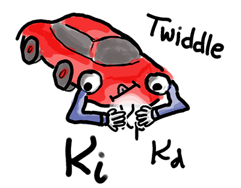

# Self Driving Car Engineer Project 9 - Implementing a PID-Controller
## Benjamin Söllner, 20 Sep 2017

---



---

This C++ project of the Udacity Self Driving Car Engineer Nanodegree implements a PID Controller to steer a vehicle on a given track. The track information as well as the control information (throttle + steering) are exchanged via a websocket interface with the Udacity Self Driving Car Simulator. The coefficients of the controller are trained with the "Twiddle" algorithm. [Here is a screencast video](https://youtu.be/87YHZ-wCMrs) that showcases successful project implementation by letting the car drive around the track for about 1 lap.

[](https://youtu.be/KOli-GG-Ank)

## Reflection

### Describe the effect each of the P, I, D components had in your implementation.

The P-term of the PID-Controller is the *proportional* term; it consists of a proportionality factor ``Kp`` times the Cross Track Error (CTE) which is the shortest distance between the car's center position and the track the car should drive on. By taking the P-term into account, we achieve that the car steers back to the track in order to minimize the Cross Track Error.

The D-term is the *differential* term; it consists of a proportionality factor ``Kd`` times the *differential* Cross Track Error (CTE), which is the difference between the current and the previous Cross-Track-Error. By taking into account the differential CTE, we achieve that the proportional term is diminished as the CTE approaches zero, thereby preventing overshooting due to latency of the controller.

The I-term is the *integral* term; it consists of a proportionality factor ``Ki`` times the *integral* Cross Track Error (CTE), which is the cumulative sum of all previous CTEs. With this term, we eliminate systematic failures like drift.

With each run, the error terms are updated as follows (see ``PID::UpdateError(...)`` in [``PID.cpp``](src/PID.cpp), ll. 44ff.):

```c++
  // differential error = current error - previous error
	d_error = cte - p_error;
	// proportional error = now the current error
	p_error = cte;
	// integral error = add current term
	i_error += cte;
```

The control value then is a simple linear combination (see ``PID::GetControl(...)`` in [``PID.cpp``](src/PID.cpp), l. 44):

```c++
double control_value = -Kp*p_error - Kd*d_error - Ki*i_error;
```

A major task was to find the right coefficients ``Kp``, ``Kd`` and ``Ki`` for the controller.

### Describe how the final hyperparameters were chosen.

The coefficients ``Kp``, ``Kd`` and ``Ki`` were first tweaked manually.

* I used a rule-of-thumb that ``Kp`` should be always about ``0.1 * Kd`` and ``Ki`` should be around ``0.1 * Kp`` according to the [discussion in this Udacity Forum post](https://discussions.udacity.com/t/how-to-implement-twiddle-optimisation/279749/23) and this [related thread on Stack Exchange](https://robotics.stackexchange.com/questions/167/what-are-good-strategies-for-tuning-pid-loops).

* With that I set up an initial speed controller with PID respectively (there was some down-tweaking of the ``Ki`` term, see [``main.cpp``](src/main.cpp), l. 40):
```c++
speed_pid.Init(.1, 1, .0001);
```
The target speed of the speed controller is given by the steering angle (see [``main.cpp``](src/main.cpp), ll. 65f.):
```c++
// Speed is between 10 and 30 mph depending on how steep the steering angle is
double target_speed = 20. * (1. - abs(steer_value)) + 10.;
```
**Note**, that I changed the order of the terms to ``Kp``, ``Kd``, ``Ki`` compared to the original declaration in the starter code.

* I then spent most of the time tuning the steering controller with a combination of coarse manual values and running twiddle on them for 1500 measurements, hoping that the car does not veer of the track. I first trained only the ``Kp`` value, then ``Kp`` with ``Kd``. This already brought results that left the car on-track for about 1 hour. I then fixed ``Kp`` and ``Kd`` and let Twiddle run on ``Ki`` only. The final result left the car on-track for about 2 hours.

* The final parameters (as well as the initial twiddle deltas, somewhat whacky numbers because I had to re-start the twiddle algorithm intermittently) can be found in [``main.cpp``](src/main.cpp), ll. 37ff.:
```c++
// Initialize the controllers.
PID speed_pid, steer_pid;
// parameters found by trial-and-error
speed_pid.Init(.1, 1, .0001);
steer_pid.Init(0.114638203899845, 1.3948260829918, 0.000055);
// uncomment to learn parameters using twiddle
// steer_pid.InitTwiddle(0.000936507, 0.0279796, 0, 2.63063e-05, 1500);
// steer_pid.InitTwiddle(0, 0, 0.00005, 0.0000001, 1500);
```

* The challenge implementing Twiddle was, that it has to run quasi-concurrent with the iteratively programmed controller loop. Therefore, it has to hold the state of where it currently is in the optimization workflow in some internal variables that get re-evaluated every time ``PID::Twiddle(...)`` is called (see [``PID.cpp``](src/PID.cpp), ll. 76ff.).

## Submitted Files

* [``README.md``](README.md), [``readme.html``](readme.html): you are reading it! :)
* [``src/PID.cpp``](src/PID.cpp): Controller logic
* [``src/main.cpp``](src/main.cpp): Boilerplate code and code for websocket communication as well as initializing + connecting both steering and speed controller
